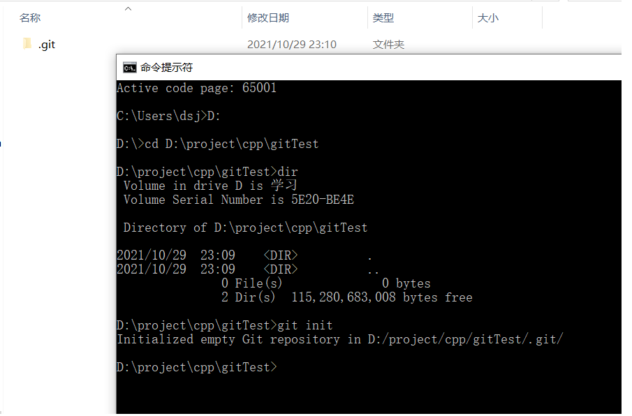
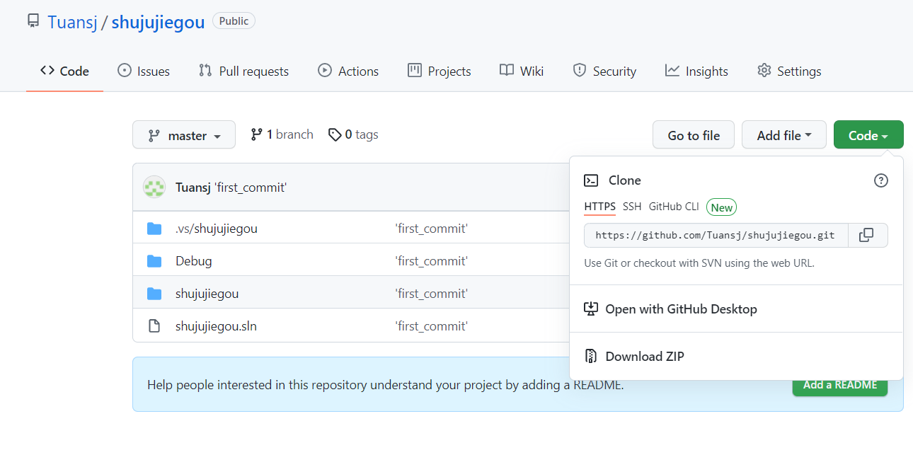
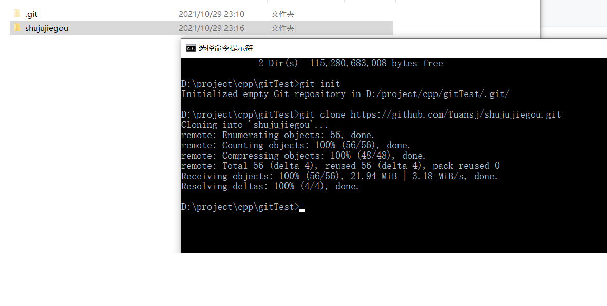
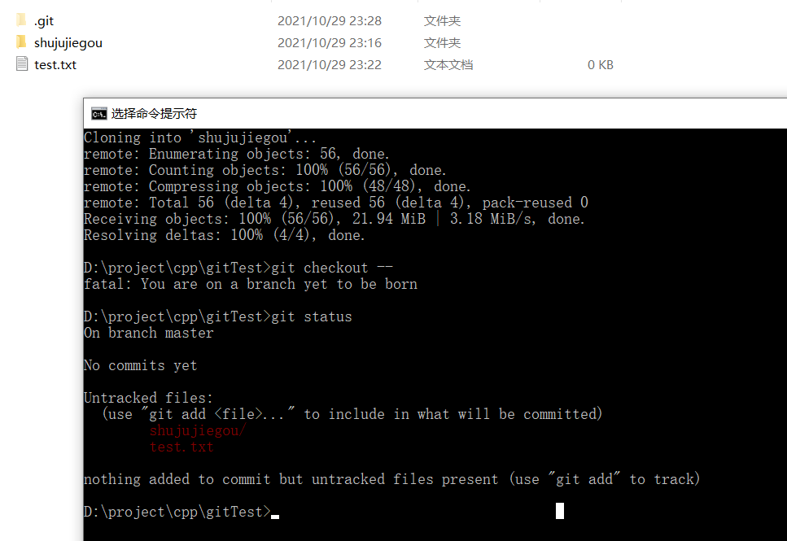
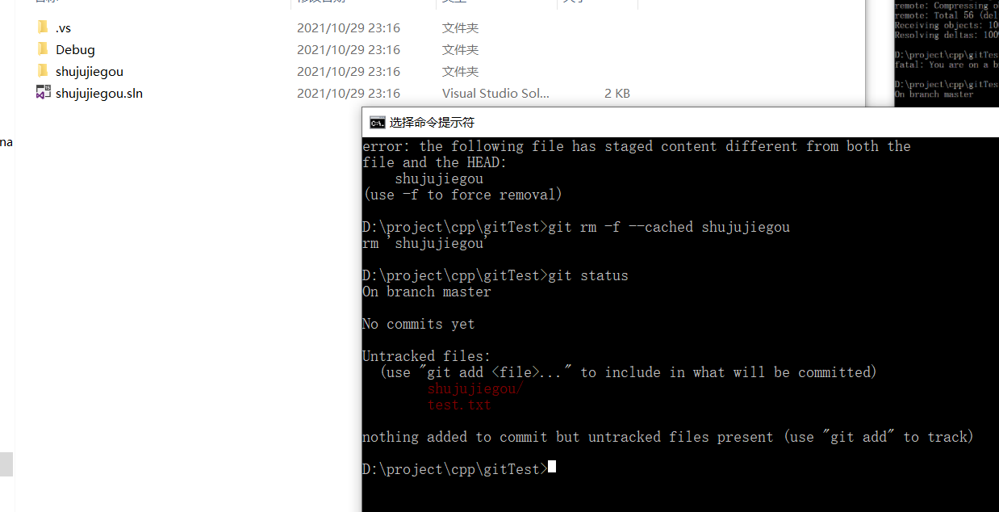
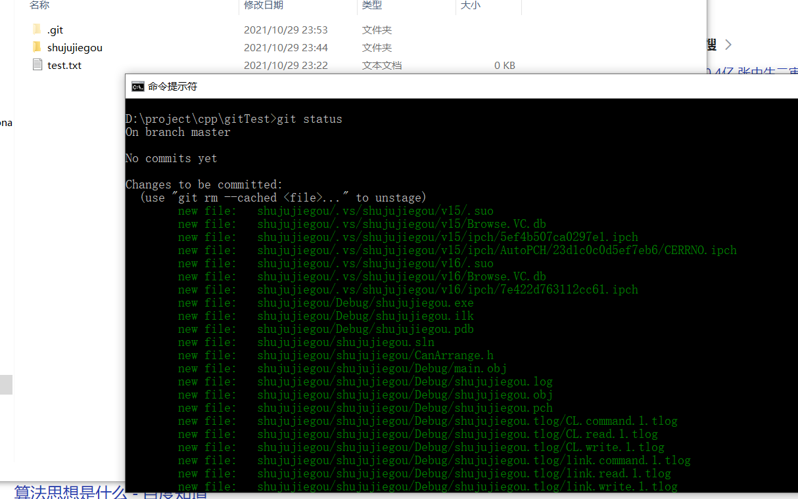
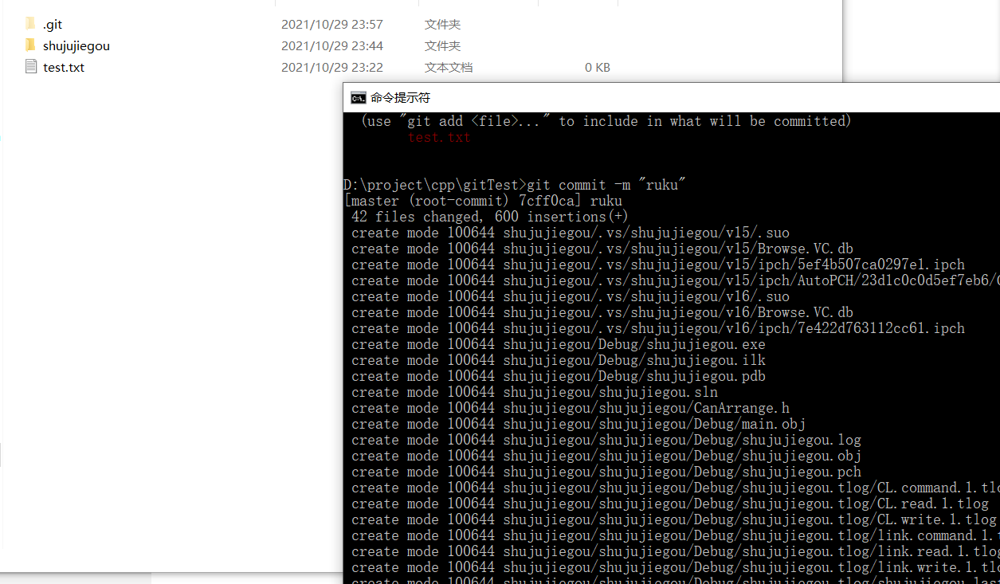

参考：

https://mp.weixin.qq.com/s?__biz=MzU4NjE1NTI2Mw==&mid=2247490799&idx=1&sn=59ae3e45ea6942405e738e9e6e1d93aa&chksm=fdfec97fca894069b674f4dd862385e3ec99f04cd96975705f797aa290966f50d63d3b263295&scene=178&cur_album_id=1337191012871143424#rd

https://www.bootcss.com/p/git-guide/

使用的命令集合：
```
git init
git clone
git status
git add origin
git commit -m ""
git remote add 
git push

error的时候:
git rm -f --cached shujujiegou
git pull --rebase origin master
git remote rm origin
```
创建仓库
```
git init
```
执行如下命令以创建一个本地仓库的克隆版本：
```
git clone /path/to/repository
```
如果是远端服务器上的仓库，你的命令会是这个样子：
```
git clone username@host:/path/to/repository
```

版本控制：
就是能够有很多分叉，而最后只要一个分叉。这种对于备份状态的把握，但是又不单纯是暴力的复制粘贴多个文件夹，而是共用了一些共同的，所以要指针进行指向共用的文件。

cmd切换到要控制版本的项目文件夹。在这里每做一个操作都是被记录的。但是记录的是这个分支下的。如果切换到另外的分支，那么文件也会变成那个分支的状态。我猜消失的文件夹是隐藏了。

 

仓库建立好，可以去clone github远程仓库的代码（下载）。亦或是本地其它仓库的代码。
 


但是当前文件夹出现的文件并不会添加到仓库中去。也就是新来的文件与仓库还没有关系，没进库。

git status

查看状态。


新创建一个test.txt文件也是一样的，没进库。

进库：
新进缓冲区
git add shujujiegou

由于shujujiegou提交的时候把git仓库也提交了，导致现在有两个仓库，从而add失败。先手动删除shujujiegou里的.git（隐藏文件）
再强制删除刚刚add的缓冲区里面的shujujiegou
```
git rm -f --cached shujujiegou
```


重新提交
```
git add shujujiegou
```
成功进入缓冲区

```
git commit -m "ruku"
```
真正入库，参数m是可以为这次提交做一个标签，comment


一般本地的库就可以完成版本管理的工作。但是我们要的是协作。故而push到hub上才能更多人一起开发。

连接到远程仓库，需要使用ssh的连接形式，同时要在这之前添加密钥
```
git remote add origin git@github.com:Tuansj/shujujiegou.git
```
密钥的添加
```
ssh-keygen -t rsa -C "1055637750@qq.com"
```
password密码可以不加。打开密钥保存的文件夹，复制粘贴到github上。再使用ssh连接就可以成功了。
```
git push origin master
```
将本地仓库传给服务器。相当于进服务器的仓库。如果差别过大，也就是服务器有的文件自己没有。也没有把这份修改add commit。就会无法上传。因此
```
git pull --rebase origin master
```
下载远程的仓库，来更新本地的目录。更新好后就可以提交了。重新git push origin master。

origin是连接时候指代的远程仓库。如果连接中止了，需要删除后，重新连接。
```
git remote rm origin
```
remote指令一般是对远程仓库进行操作了。
